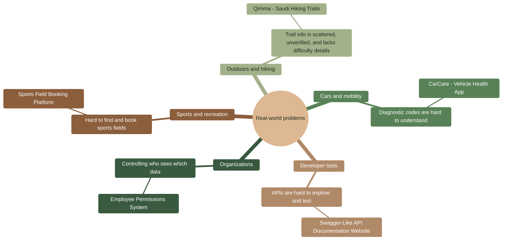

# Stage 1 Report – Team Formation and Idea Development

**Project:** Qimma (قمة) – Saudi Hiking Trails Platform
**Team:** Sarah Alkhubaizy, Rahaf Alabdalh, Dhay Aldhuwyan, Zahraa Alhussain
**Stage:** 1 – Team Formation and Idea Development

---

## 1. Team Formation Overview

### 1.1 Kickoff Meeting

The project began with an initial team meeting where all members introduced themselves and discussed their backgrounds, technical skills, interests, learning goals, and expectations for the project.

**Meeting objectives:**

- Introduce all team members and discuss their backgrounds, strengths, and interests.
- Discuss individual learning goals and expected contributions.
- Assign initial roles, including a Project Manager to coordinate Stage 1.
- Agree on communication and collaboration methods.
- Agree on the decision-making process and how the final idea would be selected.

### 1.2 Team Members and Roles

All team members contribute to both Frontend and Backend development. Each member also has a primary focus area that they lead.

| Team Member | Primary Role | Responsibilities |
|---|---|---|
| Rahaf Alabdalh | Project Manager | Coordinates the team and stage deliverables; Frontend and Backend development, API development, system integration, and testing. |
| Sarah Alkhubaizy | Backend Developer | Frontend and Backend development, database integration, testing, documentation, and feature development. |
| Dhay Aldhuwyan | UI/UX Designer & Frontend Developer | Leads design (Figma screens, visual identity); Frontend and Backend development, UI implementation, testing, and bug fixing. |
| Zahraa Alhussain | Backend Developer | Frontend and Backend development, API development, interface implementation, testing, and documentation. |

All members participate in technical discussions, code reviews, debugging, testing, and documentation.

### 1.3 Collaboration Strategies

**Communication platforms:**

- **Zoom** – primary platform for team meetings, discussions, and technical communication.
- **WhatsApp** – quick updates and urgent communication.

**Team communication rules:**

- Communicate clearly and respectfully.
- Share progress and blockers regularly.
- Discuss important technical decisions as a team.
- Inform the team early about any delays or problems.
- Give every member the opportunity to contribute ideas and opinions.

**Decision-making process:** The team discusses each decision together and first tries to reach consensus. If consensus is not reached, the decision is made by majority vote.

**Collaboration tools:**

| Tool | Purpose |
|---|---|
| GitHub | Code collaboration, version control, and Pull Requests |
| Figma | UI/UX design and prototyping |
| Zoom | Team meetings and discussions |
| WhatsApp | Quick, informal communication |

**Development workflow rules:**

- Use feature branches during development.
- No direct commits to the `main` branch.
- Merge features through Pull Requests.
- Review code before merging.
- Write clear commit messages.
- Keep documentation updated alongside development.

---

## 2. Ideas Explored

### 2.1 Brainstorming Process

The team followed four steps:

1. **Individual research:** each member looked for real-world problems in their daily life, local trends, and existing apps that could be improved.
2. **Group session – Mind Mapping:** the team mapped problem areas to possible users and solutions (see 2.1.1).
3. **"How Might We" questions:** the most promising problems were reframed as open questions (see 2.1.2).
4. **SCAMPER:** the strongest idea was developed further by applying SCAMPER to an existing solution (see 2.1.3).

The resulting five ideas were then scored against defined criteria (Section 2.3).

#### 2.1.1 Mind Map

#### 2.1.2 "How Might We" Questions

| # | How Might We… | Idea it led to |
|---|---|---|
| 1 | How might we help hikers in Saudi Arabia find safe, officially approved trails in one place? | Qimma |
| 2 | How might we help hikers judge whether a trail matches their fitness level before they go? | Qimma |
| 3 | How might we help hikers quickly find trails in a specific region of Saudi Arabia? | Qimma |
| 4 | How might we let hikers benefit from other hikers' experiences on a trail? | Qimma |
| 5 | How might we make it easier to find and book a nearby sports field? | Sports Field Booking |
| 6 | How might we help car owners understand their car's condition without a mechanic? | CarCare |
| 7 | How might we make APIs easier for students to explore and test? | Swagger-Like Website |
| 8 | How might we let organizations control data access by role? | Employee Permissions |

#### 2.1.3 SCAMPER Applied to Qimma

The team used SCAMPER on an existing global trails app (Wikiloc) to shape Qimma:

| Operation | Applied to Wikiloc | Result in Qimma |
|---|---|---|
| **Substitute** | Replace thousands of unverified user-uploaded trails | Trails approved by the Saudi Climbing and Hiking Federation |
| **Combine** | Combine the route map with trail stats and community feedback | Route map, trail details, ratings, and comments on one trail page |
| **Adapt** | Adapt a global app to the local context | Arabic-first, RTL interface with a Saudi regions filter |
| **Modify** | Modify the trail page to focus on what matters for safety | Clear start/end points, difficulty, and an approval badge |
| **Put to another use** | Use the platform as more than a hiking app | An official digital directory of approved trails that the federation can point hikers to |
| **Eliminate** | Remove features outside the core need | No trip booking, payments, or social feed – trails only |
| **Reverse** | Reverse who creates trails | Admins curate trails; users contribute ratings and comments instead of uploading routes |

### 2.2 Ideas Generated

#### Idea 1: Qimma – Saudi Hiking Trails Platform (Selected)

**Overview:** A web platform, similar to Wikiloc, that displays the hiking trails approved by the Saudi Climbing and Hiking Federation on a map. Each trail has its own page with all its details.

**Problem addressed:** Information about hiking trails in Saudi Arabia is scattered across social media and personal posts, is often unverified, and rarely includes difficulty, distance, or elevation. Hikers, especially beginners, cannot easily tell which trails are safe and suitable for them.

**Target audience:** Beginner and experienced hikers in Saudi Arabia, visitors looking for outdoor activities, and the federation as a content provider.

| Strengths | Weaknesses |
|---|---|
| Solves a clear, growing local need as outdoor activity increases in Saudi Arabia. | Depends on receiving official trail data (GPX or coordinates) from the federation. |
| Official approval gives the content credibility that general apps lack. | Map and route rendering adds technical work. |
| Clear, limited MVP scope (approved trails only, no booking). | Trail content needs to be kept up to date. |
| Uses free tools (Leaflet, OpenStreetMap). | Smaller audience than general-purpose apps. |

**Risks and constraints:** delays in receiving data from the federation; permission to use the federation's name and logo; seasonal closures that must be communicated to users.

#### Idea 2: Sports Field Booking Platform (Rejected)

**Overview:** A platform to search for nearby sports fields, view their information, and book them, including a feature for identifying fields with suitable options for women.

**Problem addressed:** Finding an available sports field requires contacting several places separately.

| Strengths | Weaknesses |
|---|---|
| Practical, everyday problem. | Real-time availability requires active participation from field owners. |
| Standard full-stack concepts. | Booking and scheduling logic increases complexity. |
| Location-based search is useful. | Similar booking apps already exist in the local market. |

**Risks and constraints:** no reliable data source for fields and availability; owners may not keep information updated.

**Reason for rejection:** It was the team's initial choice, but on re-evaluation its value depends on field owners joining and updating availability, which the team cannot guarantee within the project timeframe, and it offers less differentiation from existing apps. Qimma scored higher on feasibility of data and innovation.

#### Idea 3: CarCare – Vehicle Health Application (Rejected)

**Overview:** An app that reads data from an external OBD-II device and explains the car's condition and diagnostic trouble codes in simple language.

| Strengths | Weaknesses |
|---|---|
| Real problem for car owners. | Depends on external OBD-II hardware. |
| Educational value. | Bluetooth connectivity and device compatibility are complex. |
| Expandable. | Vehicle data must be interpreted accurately. |

**Risks and constraints:** hardware cost and availability; testing requires physical cars and devices.

**Reason for rejection:** Hardware dependency and Bluetooth integration add complexity outside the team's full-stack web focus.

#### Idea 4: Swagger-Like API Documentation Website (Rejected)

**Overview:** A website for displaying, documenting, and testing API endpoints, similar to Swagger.

| Strengths | Weaknesses |
|---|---|
| Directly related to software development. | Mature tools already exist and are widely used. |
| Good for practicing API concepts. | Hard to offer a meaningful difference. |
| Common web technologies. | Narrow, technical audience. |

**Risks and constraints:** low differentiation; limited real users.

**Reason for rejection:** Established tools already cover this need, so the project would have little new value.

#### Idea 5: Employee Permissions and Data Access System (Rejected)

**Overview:** A system for organizations to manage employee roles and control which data each employee can access.

| Strengths | Weaknesses |
|---|---|
| Real organizational problem. | Security must be implemented carefully. |
| Strong Backend learning opportunity. | Requires extensive permission testing. |
| Expandable with more roles. | Hard to demonstrate value without a real organization. |

**Risks and constraints:** security mistakes carry high risk; no real organization to test with.

**Reason for rejection:** The security and testing effort needed for a reliable permissions system is too large for the MVP timeframe.

### 2.3 Evaluation Criteria and Scoring

#### Criteria definitions

Each idea was scored from 1 to 5 on six criteria. All criteria have equal weight (maximum 30 points).

| Criterion | What it measures | 1 = | 5 = |
|---|---|---|---|
| **Feasibility** | Can the team build the MVP in the available time with accessible data and no special hardware? | Needs hardware or data the team cannot get | Fully buildable with available skills, data, and free tools |
| **Potential Impact** | How much value the solution brings to users and the community. | Minor convenience | Meaningful benefit, e.g. safety or saving significant effort |
| **User Need** | How clear and common the problem is for the target users. | Few users face it | Many users face it regularly |
| **Innovation** | How different the idea is from existing solutions in the local market. | Existing tools already do this well | No comparable local solution |
| **Technical Alignment** | How well the project fits the team's full-stack skills and learning goals. | Mostly outside the team's skills | Uses and grows the team's full-stack skills |
| **Scalability** | How easily the product can grow with new features and users after the MVP. | Hard to extend | Clear path to many future features |

#### Evaluation matrix

| Idea | Feasibility | Potential Impact | User Need | Innovation | Technical Alignment | Scalability | Total |
|---|---|---|---|---|---|---|---|
| **Qimma** | 4 | 4 | 4 | 4 | 5 | 4 | **25/30** |
| Sports Field Booking | 3 | 4 | 4 | 2 | 5 | 4 | 22/30 |
| Employee Permissions System | 3 | 3 | 3 | 2 | 4 | 4 | 19/30 |
| CarCare | 2 | 4 | 3 | 3 | 2 | 4 | 18/30 |
| Swagger-Like Website | 5 | 2 | 2 | 1 | 4 | 3 | 17/30 |

Qimma ranked first. It did not receive a full score for Feasibility because it depends on data from the federation.

---

## 3. Selected MVP Concept

### 3.1 MVP Summary

**Qimma (قمة)** is a Saudi hiking trails platform. It shows the trails approved by the Saudi Climbing and Hiking Federation on a map of Saudi Arabia. Users can filter trails by region and difficulty and open a trail page containing a map with the start point, end point, and route line; difficulty, distance, elevation gain, and estimated duration; a description with tips; the federation approval badge; ratings; and comments.

The platform focuses on trails only; it does not include trip organization or booking.

### 3.2 Reasons for Selection

The justification uses the same six criteria as the evaluation matrix.

| Criterion | Score | Justification |
|---|---|---|
| Feasibility | 4/5 | Buildable as a full-stack web project using free tools (Leaflet with OpenStreetMap). Focusing only on approved trails keeps the scope manageable. The only dependency is receiving trail data from the federation. |
| Potential Impact | 4/5 | Helps hikers choose trails that suit their level using accurate difficulty, distance, and elevation data, which supports safer hiking. |
| User Need | 4/5 | Hiking is growing in Saudi Arabia, and trail information is currently scattered and unverified. |
| Innovation | 4/5 | No local, Arabic-first platform focused on officially approved trails. The approval badge adds credibility that general apps do not have. |
| Technical Alignment | 5/5 | Covers interactive maps, a REST API, authentication, a relational database, and an admin dashboard, which exercises the whole team's full-stack skills. |
| Scalability | 4/5 | Clear future features: offline maps, GPX download, user photos, and closed-trail alerts. |

### 3.3 Problem Statement

Hikers in Saudi Arabia lack a single reliable source for trail information. Existing information is spread across social media, is often unverified, and rarely includes difficulty, distance, or elevation, which makes choosing a suitable and safe trail difficult, especially for beginners.

### 3.4 Target Audience

| User Type | Description |
|---|---|
| Beginner hikers | Need to know which trails are easy and safe before going. |
| Experienced hikers | Look for new, challenging trails with accurate route details. |
| Visitors and tourists | Look for outdoor activities in different Saudi regions. |
| Admin (team / federation) | Adds and edits trails and moderates comments. |

### 3.5 Key MVP Features

| # | Feature | Description |
|---|---|---|
| 1 | Main Map | Displays all approved trails on a map of Saudi Arabia. |
| 2 | Region Filter | Selecting a region (Asir, Madinah, Makkah, Tabuk, Riyadh, …) updates the map and trail list. |
| 3 | Difficulty Filter | Filter trails by Easy / Medium / Hard. |
| 4 | Trail Page | Map with start point, end point, and route line. |
| 5 | Trail Information | Difficulty, distance (km), elevation gain, and estimated duration. |
| 6 | Description | Trail overview and tips. |
| 7 | Approval Badge | "Approved by the Saudi Federation" badge on every trail. |
| 8 | Ratings | 1–5 star rating with average rating. |
| 9 | Comments | Users write comments and read others' comments. |
| 10 | My Trails | Save trails and view them on a saved-trails page. |
| 11 | Authentication | Sign up and log in; required for saving, rating, and commenting. |
| 12 | Admin Dashboard | Add and edit trails, and moderate comments. |

**Planned for later versions:** offline maps, GPX download, user-uploaded photos, and closed-trail alerts.

### 3.6 Potential Challenges and Opportunities

**Challenges:**

- Obtaining the official trail files (GPX or coordinates) from the federation and converting them to GeoJSON.
- Building a fully Arabic, RTL interface that works well with the map library.
- Moderating user comments.
- Completing the MVP within the available timeframe.

**Opportunities:**

- Becoming the federation's official digital reference for approved trails.
- Offline maps and GPX download for trails with no network coverage.
- User-uploaded photos and closed-trail or seasonal alerts.
- Adding new trails as the federation approves them.

### 3.7 Expected Outcomes

| Outcome | Expected Result |
|---|---|
| One trusted source | Hikers find all approved trails in one place. |
| Better trail choice | Hikers choose trails based on difficulty, distance, and elevation. |
| Safer planning | Hikers know a trail's difficulty and elevation before going. |
| Shared experience | Ratings and comments help hikers learn from each other. |
| Scalable foundation | The MVP can grow with offline maps, GPX, photos, and alerts. |

### 3.8 External Stakeholder – Questions for the Federation

1. Can we obtain the official route files (GPX or coordinates) for the approved trails?
2. Who determines the difficulty level of each trail, and based on what standard?
3. May we use the federation's name and logo in the "Approved" badge?
4. Who will add new trails in the future: the federation or our admin?
5. Are there seasonally closed trails or warnings we should display?

---

*Report prepared by: Sarah Alkhubaizy, Rahaf Alabdalh, Dhay Aldhuwyan, Zahraa Alhussain*
*Stage 1 – Portfolio Project | Holberton School*
